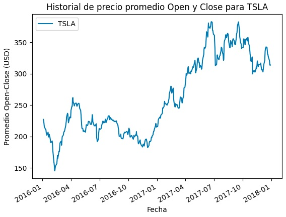
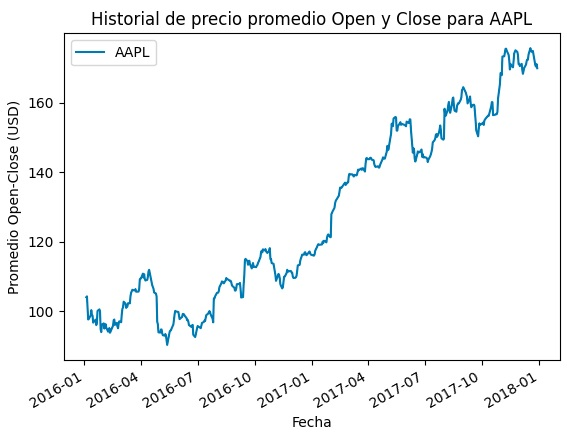
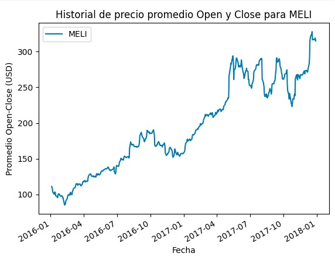
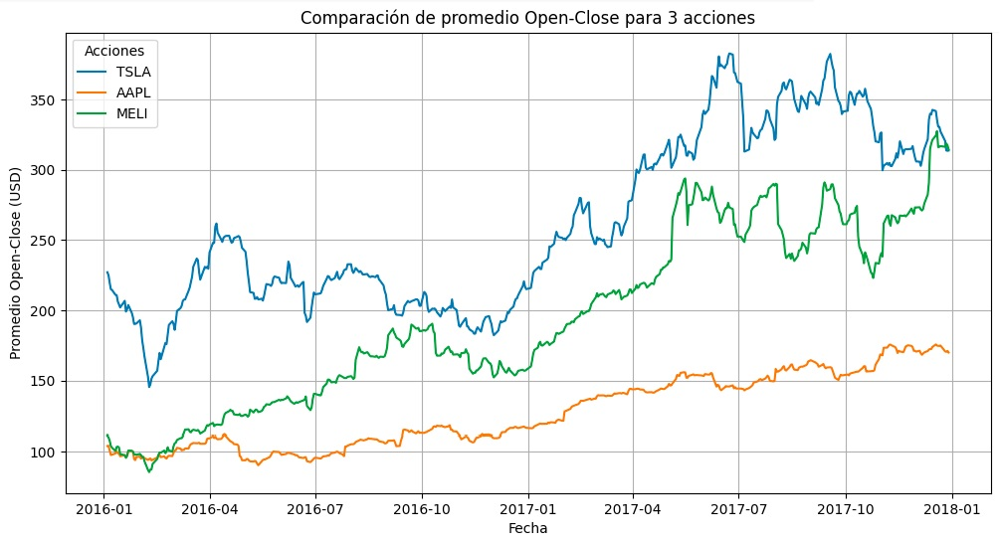

## Phyton para finanzas


El presente proyecto se basa en la creación de una notebook en Google Colab, con un análisis de datos relacionados a las acciones de diferentes compañias con gráficos históricos sobre las cotizaciones en la bolsa de valores durante el período 2016-2017. Se elegió ese período dado fué una etapa electoral en EEUU, un momento clave para la economí y los mercados financieros. 

Se icieron verificación de `splits` en los momentos de caídas abruptas para descartar una división de las acciones existentes, en varias nuevas para bajar el precio unitario sin cambiar el valor total que posee cada accionista. La consulta fué hecha en el sitio web `finance.yahoo`. Afortunadamnte, las empresas analizadas no tuvieron slipts dentro del lapso sometido análisis.

Se deja a disposición video explicativo ([Link AQUÍ](https://view.genially.com/67ca73e4481e4913c9a91756)).

1. **Instalación de Librería**

`alpha_vantage` = para acceder a datos financieros y económicos en tiempo real o históricos a través de la API de Alpha Vantage
   ```
   !pip install alpha_vantage
   print("importación exitosa")
   ```
Luego de cada instalación o importación se coloca un print para confirmar que corre exitosamente.
   
2.  **Instalación de Métodos**

Se procede a importar los métodos necesarios
   ```
  from alpha_vantage.timeseries import TimeSeries # Importación del método TimeSeries a través de la API alpha_vantage
  print("importación del método TimeSeries exitoso")
  import matplotlib.pyplot as plt # Importación libreria para visualización de datos en gráficos
  print("importación de matplotlib exitosa")
  import pandas as pd # Importación libreria para manipulación de dataframe
  print("importación de pandas exitosa")
  ```

3.  **Obtención de API_KEY**

Se realiza a través del sitio web: https://www.alphavantage.co/

4. **Se crea una lista de accciones**

Inicialmente el listao se compone por 6 empresas, luego el análisis se enfoque en 3.
  ```
  lista_acciones = ["MELI","TSLA", "AAPL","MSFT","AMZN","GOOGL"]
  # Nombre reales por orden de aparición: MercadoLibre, Tesla, Apple, Microsoft, Amazon y Google
  print("lista de acciones creada con éxito")
  ```
5. **Creación de Dataframe con variable Stock**

Abarca el período de elecciones EEUU 2016. Primero se procede a la iniciación del dataframe vacío como buena práctica, en segundo lugar se definen las fechas que abarcan el período electoral en USA con el traspaso del poder Obama-->Trump.
```
fecha_inicio = "2016-01-01"
fecha_fin = "2017-12-31"
```
Luego se conecta con la key de alpha_vantage y posteriormente se realiza una conversión del indice del dataframe de formato data a datatime, se ordena el índice en orden cronológico, se aplica un filtro por fechas, se concatena los datos en df_stocks y se procede a la visualización de la tabla:

| date       | open    | high     | low      | close   | volume     | Stock |
|------------|---------|----------|----------|---------|------------|-------|
| 2016-01-04 | 112.36  | 112.840  | 108.145  | 109.95  | 535284.0   | MELI  |
| 2016-01-05 | 110.51  | 112.355  | 108.600  | 109.68  | 432668.0   | MELI  |
| 2016-01-06 | 107.98  | 108.980  | 106.110  | 107.33  | 579179.0   | MELI  |
| 2016-01-07 | 104.97  | 106.200  | 101.630  | 102.93  | 475036.0   | MELI  |
| 2016-01-08 | 104.39  | 104.880  | 100.860  | 101.09  | 443968.0   | MELI  |
| ...        | ...     | ...      | ...      | ...     | ...        | ...   |
| 2017-12-22 | 1070.00 | 1071.720 | 1067.640 | 1068.86 | 860800.0   | GOOGL |
| 2017-12-26 | 1068.64 | 1068.860 | 1058.640 | 1065.85 | 914574.0   | GOOGL |
| 2017-12-27 | 1066.60 | 1068.270 | 1058.380 | 1060.20 | 1027634.0  | GOOGL |
| 2017-12-28 | 1062.25 | 1064.840 | 1053.380 | 1055.95 | 982285.0   | GOOGL |
| 2017-12-29 | 1055.49 | 1058.050 | 1052.700 | 1053.40 | 1156357.0  | GOOGL |

3018 rows × 6 columns

`CONCLUSIONES SOBRE JUSTIFICACIÓN DEL PERÍODO DE ANÁLISIS:` Inicialmente, se contempló analizar el período que comprende el ataque a las Torres Gemelas (2001) debido al impacto significativo que este evento tuvo en los mercados financieros. Sin embargo, descubrí que algunas de las empresas del listado solicitado para este trabajo final no cotizaban públicamente en esa época, lo que dificultaba llevar a cabo un análisis integral y representativo.

Posteriormente, se consideró el período pandémico, pero fué descartado ya que se trata de un tema ampliamente estudiado y podría carecer de originalidad en el contexto de este análisis.

Finalmente, opté por centrar el estudio en el impacto de las elecciones presidenciales de EEUU durante el período 2016-2017, un marco temporal en el que todas las empresas involucradas ya cotizaban en bolsa. Este enfoque permite explorar como un evento político significativo puede influir en las dinámicas del mercado y en las empresas seleccionadas.

Estas elecciones resultaron particularmente relevantes debido a que la oposición (representada por Donald Trump) tenía una ideología radicalmente diferente a la de Obama. Este tipo de transiciones ideológicas suele generar incertidumbre y volatilidad en los mercados bursátiles, ya que los inversores tienden a ajustar sus expectativas y estrategias en función de los posibles cambios en políticas económicas, fiscales o regulatorias.

6. **Consulta para corroborar información**

Como el listado anterior solo muestra 2 empresas (MELI & GOOGL) se realiza la siguiente consulta para corroborar la presencialidad de la totalidad de compañias en el análisis
```
print(df_stocks["Stock"].unique())  # muestra los simbolos de todas las empresas
print(len(df_stocks["Stock"].unique()))  # muestra el total de empresas
print(df_stocks["Stock"].value_counts())  # cantidad de filas por cada empresa
```
`MELI`, `TSLA`, `AAPL`, `MSFT`, `AMZN` y `GOOGL`.
| Ticker | Registros |
|--------|-----------|
| MELI   | 503       |
| TSLA   | 503       |
| AAPL   | 503       |
| MSFT   | 503       |
| AMZN   | 503       |
| GOOGL  | 503       |

7. **Nueva Columna de cálculo promedio por acción** (entre precio open y close)
```
df_stocks["Promedio_Open_Close"] = (df_stocks["1. open"] + df_stocks["4. close"]) / 2 # creación de columna promedio
df_stocks  # visualización de tabla con nueva columna del promedio
```
| date       | open     | high     | low      | close    | volume     | Stock | Promedio_Open_Close |
|------------|----------|----------|----------|----------|------------|-------|---------------------|
| 2016-01-04 | 112.36   | 112.840  | 108.145  | 109.95   | 535284.0   | MELI  | 111.155             |
| 2016-01-05 | 110.51   | 112.355  | 108.600  | 109.68   | 432668.0   | MELI  | 110.095             |
| 2016-01-06 | 107.98   | 108.980  | 106.110  | 107.33   | 579179.0   | MELI  | 107.655             |
| 2016-01-07 | 104.97   | 106.200  | 101.630  | 102.93   | 475036.0   | MELI  | 103.950             |
| 2016-01-08 | 104.39   | 104.880  | 100.860  | 101.09   | 443968.0   | MELI  | 102.740             |
| ...        | ...      | ...      | ...      | ...      | ...        | ...   | ...                 |
| 2017-12-22 | 1070.00  | 1071.720 | 1067.640 | 1068.86  | 860800.0   | GOOGL | 1069.430            |
| 2017-12-26 | 1068.64  | 1068.860 | 1058.640 | 1065.85  | 914574.0   | GOOGL | 1067.245            |
| 2017-12-27 | 1066.60  | 1068.270 | 1058.380 | 1060.20  | 1027634.0  | GOOGL | 1063.400            |
| 2017-12-28 | 1062.25  | 1064.840 | 1053.380 | 1055.95  | 982285.0   | GOOGL | 1059.100            |
| 2017-12-29 | 1055.49  | 1058.050 | 1052.700 | 1053.40  | 1156357.0  | GOOGL | 1054.445            |

8. **Graficos sobre 3 acciones de interés por separado** (TSLA, AAPL y MELI)
```
acciones_interes = ["TSLA", "AAPL", "MELI"]  # lista de acciones elegidas para graficar

# Gráficos individuales para cada acción
for accion in acciones_interes:
    df_accion = df_stocks[df_stocks["Stock"] == accion]  # Filtrar por acción
    df_accion["Promedio_Open_Close"].plot(label=accion)  # Graficar el promedio por acción
    plt.title(f"Historial de precio promedio Open y Close para {accion}")
    plt.xlabel("Fecha")
    plt.ylabel("Promedio Open-Close (USD)")
    plt.legend()
    plt.show()
```






`CONCLUSIONES SOBRE LOS GRÁFICOS:` 

Se llevó a cabo un análisis de splits para verificar si las caídas en los precios de las acciones observadas en los gráficos eran consecuencia de estos eventos. Los resultados mostraron que Apple no realizó splits en el período analizado (sino el 28/02/2005 Split de 2:1, 09/06/2014 Split de 7:1 y 31/08/2020 Split de 4:1). En el caso de Tesla, tampoco se produjeron splits dentro del período analizado (sino el 31/08/2020 Split de 5:1 y 25/08/2022 Split de 3:1).

Sorprendentemente MercadoLibre JAMÁS hizo splits a la fecha. Esto indica que las caídas observadas en los gráficos no están relacionadas con splits y podrían deberse a otras causas del mercado.

Tesla refleja un crecimiento acelerado que evidencia las expectativas del mercado por su innovación en el sector automotriz eléctrico. Pre-elecciones (a inicios del 2016) sufre una caída importante en el precio promedio, pero luego de las elecciones mejora muchísimo su cotización.

Apple presenta un crecimiento más estable y progresivo, con una pendiente positiva constante en el tiempo. Esto podría vincularse al prestigio líder en tecnología, respaldada por lanzamientos consistentes y una base de clientes fidelizada. En consecuencia, no se observan comportamientos bruscos en el mercado producto de las elecciones, sino más bien a épocas festivas como navidad, año nuevo, etc.

MercadoLibre muestra un incremento constante y sostenido pero no tan progresivo como Apple. Previo a las elecciones se observa una caída, aunque mantiene una tendencia positiva y luego refuerza su crecimiento.

9. **Grafio de las 3 acciones juntas en el mismo gráfico:** (beneficia la comparación)
```
acciones_interes = ["TSLA", "AAPL", "MELI"]

# Crear gráfico combinado
plt.figure(figsize=(12, 6))
for accion in acciones_interes:
    df_accion = df_stocks[df_stocks["Stock"] == accion]  # Filtrar por acción
    plt.plot(df_accion.index, df_accion["Promedio_Open_Close"], label=accion)  # Graficar promedio

# Configuración del gráfico
plt.title("Comparación de promedio Open-Close para 3 acciones")
plt.xlabel("Fecha")
plt.ylabel("Promedio Open-Close (USD)")
plt.legend(title="Acciones")
plt.grid()
plt.show()
```



`CONCLUSIONES GENERALES:` Aunque se trata de tres empresas con actividades muy diferentes, las tres muestran comportamientos diferenciados, lo que refleja la naturaleza de sus industrias y los factores específicos que las afectan. Tesla destaca por su volatilidad, mientras que Apple y MercadoLibre presentan un crecimiento más uniforme, con influencia de eventos externos como las elecciones y las temporadas de consumo. En síntesis, los efectos de las elecciones presidenciales de 2016 fueron más significativos para empresas tecnológicas como Tesla, que se vieron impulsadas por las expectativas del mercado.

10. **Se procede a efectuar una potencial predicción sobre TSLA en función de un período anterior definido:

Se decidió basar el análisis predictivo en los 7 días posteriores a las elecciones, y se comprueba que la predicción fué atinada, puesto que Tesla incrementó su precio promedio y por lo tanto se alinea con la tendencia observada en los datos reales. Este comportamiento podría estar relacionado con un aumento en la confianza de los inversionistas hacia la compañía tras las elecciones.

Para llevar adelante esa pequeña predicción se utilizaron las siguientes librerías:

```
import numpy as np # para hacer cálculos aritméticos
print("importación de numpy exitosa")
from sklearn.preprocessing import MinMaxScaler # importación de la clase MinMaxScaler de la libreria sklearn del módulo preprocessing
print("importación de MinMaxScaler exitosa")

#IMPORTACIONES PARA CREACIÓN DE RED NEURONAL
from tensorflow.keras.models import Sequential
print("importación de tensorflow.keras.models Sequential exitosa")
from tensorflow.keras.layers import Dense, SimpleRNN, Reshape
print("importación de tensorflow.keras.layers,etc. exitosa")
```


## GIF EXPLICATIVO

<p align="center">
  
</p>

